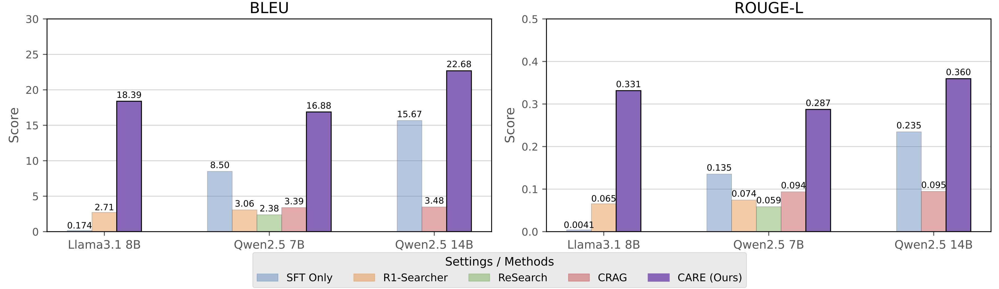
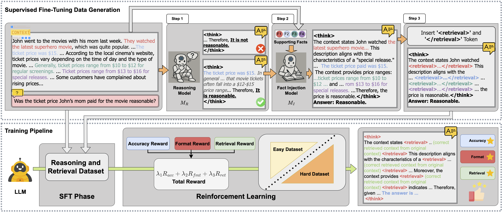

# CARE: Improving Context Fidelity via Native Retrieval-Augmented Reasoning


Large language models (LLMs) often struggle with **context fidelity**, producing inconsistent or hallucinated answers even when relevant information is present.  
We propose **CARE**, a native retrieval-augmented reasoning framework that integrates in-context evidence directly into the reasoning chain.  
This work represents a step toward making LLMs more accurate, reliable, and efficient for knowledge-intensive tasks.
---

### Results Overview
<p align="center">
  
</p>
<p align="center"><em>Figure 1: Comparison of model performance across different settings. CARE demonstrates improved results over baselines on multiple QA benchmarks.</em></p>

### Method Overview
<p align="center">
  
</p>

<p align="center"><em>Figure 2: A schematic illustration of the training data and process. The upper part shows SFT data generation (fact injection and special tokens), while the lower part shows the SFT training process together with reinforcement learning (RL) using multiple rewards.</em></p>

---

## 🔧 Installation

Requirements:
- Python **3.9+**  
- [requirements.txt](./requirements.txt) includes:
  - `transformers>=4.51.0`
  - `flash-attn>=2.4.3`
  - `vllm>=0.8.3`
---
Clone and install:
```bash
git clone https://github.com/FoundationAgents/CARE
cd CARE
pip install -r requirements.txt
pip install -e .
```

---

## 📥 Data and Model Download

Use the provided helper script to download Qwen models and datasets (DROP, MuSiQue):

```bash
python CARE/scripts/load_script/load_dataset.py
```

```bash
python CARE/scripts/load_script/load_model.py
```
This will save all resources under `CARE/datasets/`.

---

## 🚀 Reinforcement Learning

We provide ready-to-run training examples.
For Qwen2.5-7B with DROP + MuSiQue:

```bash
bash CARE/scripts/training_examples/run_qwen2_5_7b_retrieve_mix_musique.sh
```

Edit the script to change:

* **MODEL\_PATH** → local checkpoint path or Hugging Face repo id.
* **data.train\_files / data.extra\_files / data.val\_files** → datasets.
* **SYSTEM\_PROMPT** → reasoning style prompt.
* **trainer.max\_steps / trainer.n\_gpus\_per\_node** → training setup.

---

## 📊 Results


---

### Benchmark Comparison

| Model            | Method      | MFQA      | HotpotQA  | 2WikiMQA  | MuSiQue   | Average   |
| ---------------- | ----------- | --------- | --------- | --------- | --------- | --------- |
| **LLaMA-3.1 8B** | Original    | *45.57*   | *54.64*   | 45.87     | 32.08     | 44.54     |
|                  | R1-Searcher | 28.44     | 53.71     | *67.10*   | *41.41*   | *47.67*   |
|                  | **CARE**    | **49.94** | **63.09** | **75.29** | **51.00** | **59.83** |
| **Qwen2.5 7B**   | Original    | 46.94     | *58.47*   | 46.96     | 30.78     | 45.79     |
|                  | R1-Searcher | 28.36     | 55.43     | *65.79*   | *47.09*   | *49.17*   |
|                  | **CARE**    | **48.11** | **63.45** | **70.11** | 45.57     | **56.81** |
| **Qwen2.5 14B**  | Original    | 47.58     | *61.94*   | *59.05*   | *37.99*   | *51.64*   |
|                  | CRAG        | **50.89** | 44.74     | 34.68     | 28.17     | 39.62     |
|                  | **CARE**    | *48.81*   | **67.75** | **78.68** | **51.27** | **61.63** |
<p align="center"><em>Table 1: Evaluation on real-world QA datasets. Results are grouped by the base LLM. The best and second-best results are shown in <b>bold</b> and <u>underline</u>, respectively. Slash (/) indicates unavailable checkpoints or unsupported models.</em></p>


### Ablation Study

| Setting      | SFT | RL | Retrieval | Curriculum | MFQA     | HotpotQA   | 2WikiMQA   | MuSiQue   | CofCA     | Average   |
| ------------ | --- | -- | --------- | ---------- | -------- | -----------| -----------| ----------| ----------| ----------|
| Baseline     | ✗   | ✗  | ✗         | ✗          | _46.64_  | 58.47      | 46.96      | 30.78     | 58.38     | 48.25     |
| SFT Only     | ✓   | ✗  | ✗         | ✗          | 42.24    | 47.08      | 61.51      | 33.82     | 59.21     | 48.77     |
| No Retrieval | ✓   | ✓  | ✗         | ✗          | 37.66    | 62.59      | _70.57_    | 43.85     | 57.26     | 54.39     |
| No Curriculum| ✓   | ✓  | ✓         | ✗          | 38.33    | **64.10**  | **70.69**  | **47.49** | _60.60_   | _56.24_   |
| **CARE**     | ✓   | ✓  | ✓         | ✓          | **48.11**| _63.45_    | 70.11      | _45.57_   | **64.56** | **58.36** |
<p align="center"><em>Table 2: Ablation studies on QA tasks based on Qwen2.5-7B. The best and second-best results are shown in <b>bold</b> and <u>underline</u>, respectively. “Ret.” indicates the retrieval reward, and “Cur.” indicates curriculum learning.</em></p>

📌 *Whether to enable curriculum learning can be controlled in*  
[`verl/trainer/config.py`](verl/trainer/config.py).
